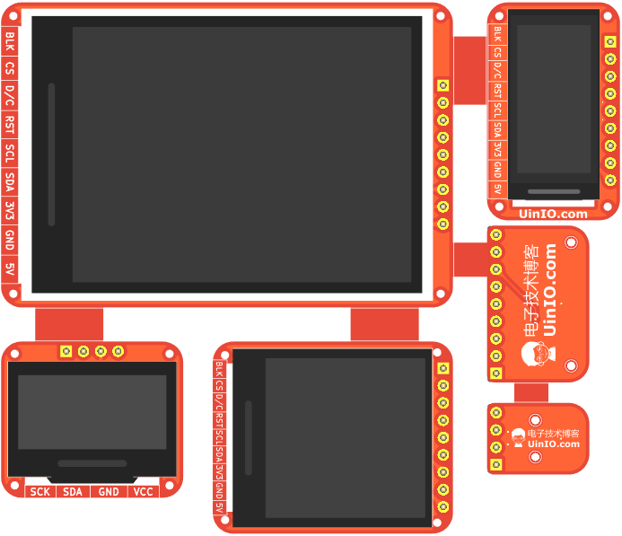
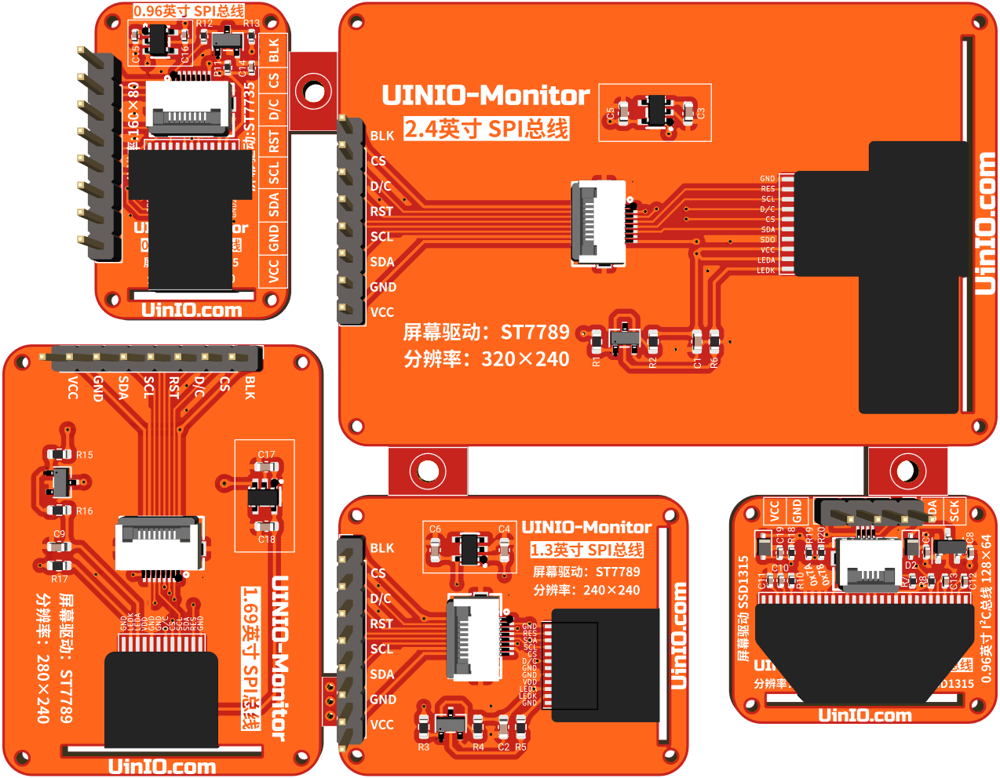

# UINIO-Monitor 显示屏幕模组

[**UINIO-Monitor**](https://gitee.com/uinika/UINIO-Monitor) 是一款同时拼接了 **0.96 英寸 LCD 显示屏**（`ST7735`，`160×80`）、**0.96 英寸 OLED 显示屏**（`SSD1315`，`128×64`）、**1.3 英寸 LCD 显示屏**（`ST7789`，`240×240`）、**2.4 英寸 LCD 显示屏**（`ST7789`，`240×320`）、**1.69 英寸 LCD 显示屏**（`ST7789`，`240×280`） 的五合一屏幕驱动电路设计。

## 功能概要

1. 采用 **FreeCAD** 绘制了合理并且美观的板框（长度与宽度均小于或等于 `10cmm`）；
2. 分别提供有 4 个 `1mm` 直径螺丝孔，便于安装至其它结构件，快速搭建出产品原型；
3. **LCD** 屏幕的外接引脚**线序**全部保持统一，并且重要的**丝印**信息会同时标注在 PCB 的**顶层**与**底层**；
4. PCB 板载 `0.5mm` 间距的 **FPC** 柔性排线连接器，同时还引出了 `2.54mm` 间距的直插排针，便于通过杜邦线快速搭建实验电路；
5. 由于 **OLED** 屏幕的功耗相对较小，因而采用了 `300mA` 输出的线性稳压芯片 `XC6206P332MR`；而功耗相对较大的 **LCD** 屏幕，则统一采用 `ME6211C33M5G-N` 线性稳压芯片；

## 注意事项

1. 工程的 `CAD` 目录下，保存的是 **FreeCAD** 绘制的 PCB 板框草图文件；
2. 工程的 `3D Models` 文件夹，保存的是 LCD 和 OLED 裸屏的 **3D** 模型 **FreeCAD** 源文件；
3. 工程的 `Reference` 目录下提供了裸屏相关的数据手册以及参考原理图；
4. **0.96 英寸 OLED 显示屏** 同时兼容采用 `SSD1306` 和 `SSD1315` 两款驱动芯片的屏幕；
5. 由于 `XC6206P332MR` 电源正负极反接时，极易导致线性稳压芯片烧毁，所以串联 **SOD-323** 封装的肖特基二极管防止反接；
6. 当使用 **Arduino** 的 **U8g2** 库驱动 **0.96 英寸 OLED 显示屏** 的时候，必须焊接上 `R20` 电阻，而 `R19` 电阻位置可以留空；
