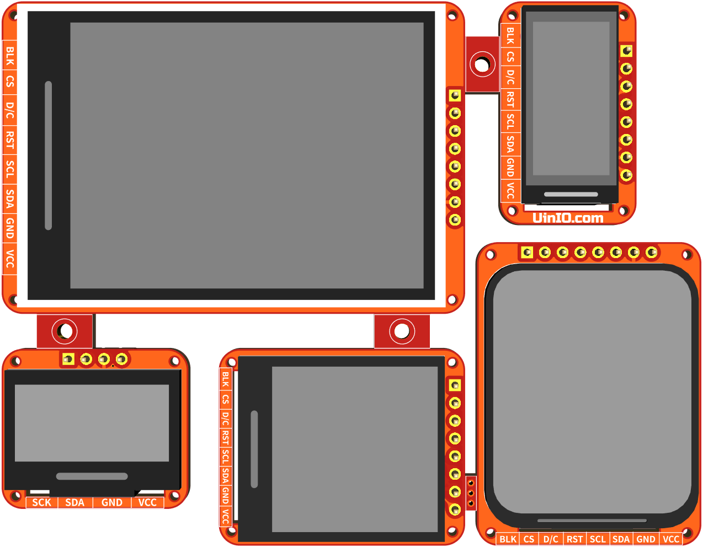

# UINIO-Monitor SPI & I²C 总线显示屏模组

## 功能概要

- 采用 **0.96 英寸 OLED 显示屏（SSD1315，128×64）**、**1.3 英寸 LCD 显示屏（ST7789，240×240）**、**2.4 英寸 LCD 显示屏（ST7789，240×320）** 拼板设计；
- 采用 `0.5mm` 间距的 FPC 排线连接器，以及四个 `1mm` 螺丝孔，便于安装到其它结构件上面，快速搭建出产品原型；
- 同时还引出了 `2.54mm` 间距的直插排针，便于通过杜邦线和面包板连接进行实验；
- 由于 OLED 屏幕的功耗相对较小，因而采用了 `300mA` 输出的低功耗 LDO 线性稳压器 `XC6206P332MR`；
- 而针对 LCD 显示屏功耗较大的情况，专门提供有单独的 `5V` 引脚供电，并且通过板载的 `ME6211C33M5G-N` 线性稳压器将其转换为稳定的 `3.3V` 输出；

## 注意事项

- `3.3V` 电源输出功率足够的场景下，可以直接连接 `3.3V` 引脚进行使用，同时 `5V` 引脚直接悬空处理；
- 工程根目录下的 `3D Models` 文件夹，保存的是液晶屏 3D 模型的 **FreeCAD** 源文件；
